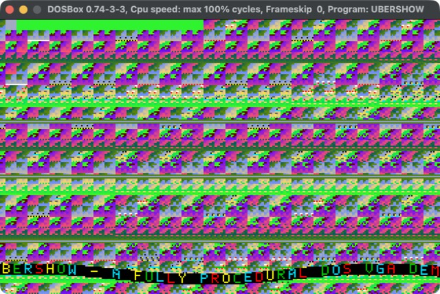
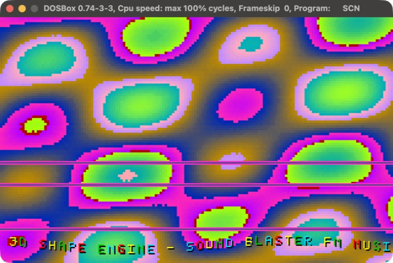
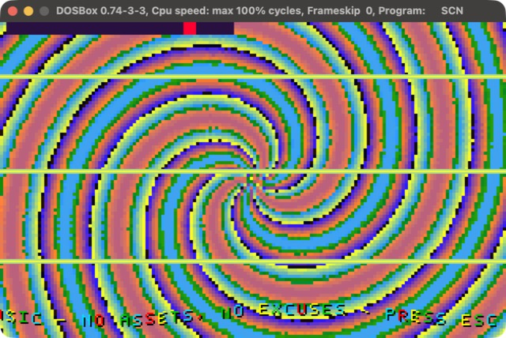
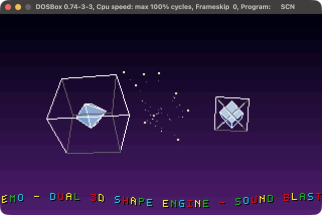

# UBER40K

**A zero-asset DOS demo with a real 3D engine and Sound Blaster FM music, in about 8 KB of hand-written x86 assembly.**

[](https://github.com/djayuffe/uber40k-dos-demo/actions/workflows/ci.yml)



Two flat 16-bit real-mode `.COM` programs written in NASM. They run in DOSBox or on
real VGA + Sound Blaster/AdLib hardware. There are no images, fonts, samples, trackers,
libraries or extenders: every pixel, glyph, FM note and 3D vertex is generated by the
code. "40K" names the size class (a 40,960-byte budget); the full show uses under a quarter of it.

| Program | What it is | Size | Video | Audio |
|---|---|---|---|---|
| `UBERSHOW.COM` (`showcase.asm`) | 18-scene demo: 3D engine, starfield, scroller, music | ~10 KB | VGA mode 13h | OPL2 FM |
| `UBER256.COM` (`intro256.asm`) | strict sizecoded intro, hard 256-byte gate | 70 bytes | VGA mode 13h | silent |

## Run it

Download `UBERSHOW.COM` from the [latest release](../../releases/latest) and run it in
DOSBox (`mount c .`, `c:`, `UBERSHOW.COM`), or build it yourself:

```sh
./build.sh        # NASM build, 256-byte gate and static audits
./run-dosbox.sh   # run UBERSHOW.COM (pass UBER256.COM for the intro)
```

**Esc** exits cleanly. Needs [NASM](https://www.nasm.us/) and [DOSBox](https://www.dosbox.com/)
(macOS: `brew install nasm` and `brew install --cask dosbox`). Use `cycles=max`
(shipped in `DOSBOX.CONF`); a low fixed cycle count will stutter.

## Highlights

- **3D engine**: perspective projection, backface culling, directional lighting,
  scanline polygon fill, interpolated rotation every frame. A solid shaded cube and
  octahedron over a night-sky gradient with a starfield.
- **Wireframe phase**: the objects turn into hollow force-fields. Stars bounce off
  them, and a small solid core spins inside each.
- **OPL2 FM music**: lead, bass, pad and echo voices plus the chip's rhythm section,
  over a 4-bar progression (Am | C | G | Em), with a fill and a cymbal crash.
  Talks to the chip directly at `388h`, so it works on any Sound Blaster or AdLib.
- **True hardware double buffering**: 128K VGA window and CRTC page flip. No blit,
  no DOS allocation.
- **Sine-wave scroller** with a hand-made 5x7 font, scene fades and shutter transitions.
- **Tested behaviour**: ~80 checks run the real binary in an emulated CPU (see Testing).

## Screenshots

All captured from the real binary running in DOSBox.

| | |
|---|---|
|  |  |
| **Scene 1: sine plasma.** Three sine waves summed and mapped onto the animated palette, with the shadowed sine scroller along the bottom. | **Scene 15: spiral vortex.** Coordinates are rotated by an angle that grows with distance from the centre. |
|  |  |
| **Scene 16, solid phase.** Perspective projection, backface culling and a directional light with a 16-step shading ramp, over a night-sky gradient with stars. | **Scene 16, wireframe phase.** The objects become hollow force-fields: stars bounce off them and a small solid core spins inside each. |

## The scenes

| # | Scene | Technique |
|---|---|---|
| 1 | Sine plasma | two diagonal waves + a row wave |
| 2 | Tunnel | angle stripes x 1/r depth rings (polar map) |
| 3 | Orbs | crossing wave families in polar space |
| 4 | Moire | fine rays against moving rings |
| 5 | Soft checker | egg-crate of two perpendicular waves |
| 6 | Ripples | pure rings travelling outwards |
| 7 | Ribbons | near-vertical twisting bands |
| 8 | Interference | three moving waves |
| 9 | Copper bars | fast near-horizontal bars |
| 10 | Diamonds | crossed diagonal waves |
| 11 | Lattice | fine diagonal lattice |
| 12 | Wavy bands | slow oblique waves |
| 13 | Scanwave | dense scanline waves |
| 14 | Rotating grid | wave directions turn with time |
| 15 | Vortex | three-armed spiral |
| 16 | **Cube + octahedron (3D engine)** | solid shaded, wireframe force-fields with bouncing stars |
| 17 | **3D starfield** | perspective stars with trails |
| 18 | Finale | fast two-armed spiral |

Scenes 1-15 and 18 run on a lookup-table field engine (see Performance below), so they
are smooth and cheap. Scenes 16-17 draw 3D content instead. Every scene has raster bars
(except the 3D ones), a progress strip, fades, and the bottom scroller.
Each scene lasts 512 frames (~7.3 s at 70 Hz); a full pass is ~2 minutes.

## Performance: built to hold 70 Hz

A frame has to finish inside one vertical retrace (~14 ms) or the display stutters.
The first field scenes cost **2-3 million instructions a frame**, hopeless on real
hardware. The engine now costs about **240k** (3D scenes ~130k), measured by running
the real binary in the emulator, and a test keeps it under budget.

| Trick | What it does |
|---|---|
| Half resolution | each value is computed once per 2x2 block and stored as a doubled word to two rows; the fields are smooth, so nobody can tell |
| Lookup tables | a pixel is a few table reads and adds; the sine waves are precomputed 256-entry tables |
| Polar maps | angle and radius for every block are computed once at start, so tunnels, rings and spirals are `TA[angle] + TR[radius]` with no `atan`/`sqrt` per frame |
| Cheap palette | fixed colours fit in the blank; the animated sweep is spread over four frames |
| Direct scroller stores | no per-pixel clipping or multiply |

## Layout

```
showcase.asm        full demo source
intro256.asm        256-byte intro source
build.sh            NASM build + gates
run-dosbox.sh       DOSBox launcher (builds a temp conf; keeps cycles=max)
DOSBOX.CONF         DOSBox settings
audit*.py, release_audit.py   static source audits
tests/              behavioural tests (Unicorn CPU emulator)
.github/workflows/  CI and tag-driven releases
TECHNICAL.md        how it works
CHANGELOG.md        release notes and the bugs found along the way
MANIFEST.sha256     hashes of the source tree
```

## Testing

Three layers, because each catches what the others cannot:

1. **Static audits** (run by `./build.sh`): source-text invariants. Fast, but they
   cannot see behaviour.
2. **Behavioural tests** (`tests/run_tests.sh`; needs Python 3, installs `unicorn`
   into `./.venv`; a few minutes): runs the built `.COM` in an emulated 16-bit CPU,
   trapping port I/O and DOS/BIOS calls. Checks that every note is in tune and in key,
   drums land where intended, the chip is silenced at exit, solid faces are lit and
   culled, rotation is smooth, `sincos16`/`fill_poly`/`draw_line` match oracles, the
   fade is proportional, stars bounce, all 18 scenes stay inside their page, and the
   frame loop flips in the right order. Run one group with `tests/run_tests.sh music`.
3. **A real DOSBox run**: the only way to judge how it looks. This caught a palette
   tear that the other two layers could not see.

## Releases and CI

Every push and pull request runs the build, audits and behavioural tests on GitHub
Actions and uploads the binaries. To release, add a section to `CHANGELOG.md` and push a tag:

```sh
git tag v1.0.0 && git push origin v1.0.0
```

The release workflow rebuilds, re-tests and publishes `UBER256.COM`, `UBERSHOW.COM`,
`SHA256SUMS` and the screenshot with that section as the notes.

## How it works

See [TECHNICAL.md](TECHNICAL.md) for the frame loop and page flip, palette ordering,
the 3D pipeline, the starfield bounce, the music engine and the pitfalls hit on the
way. Release history and known limitations are in [CHANGELOG.md](CHANGELOG.md).
